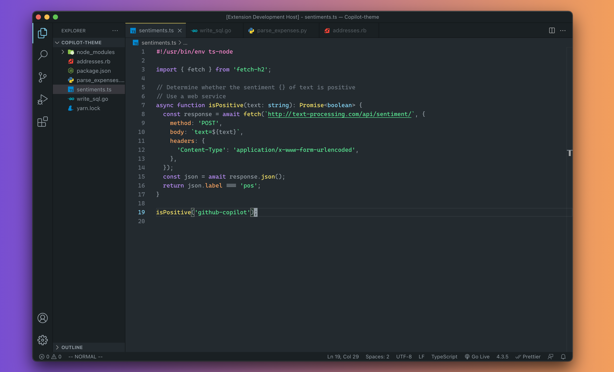
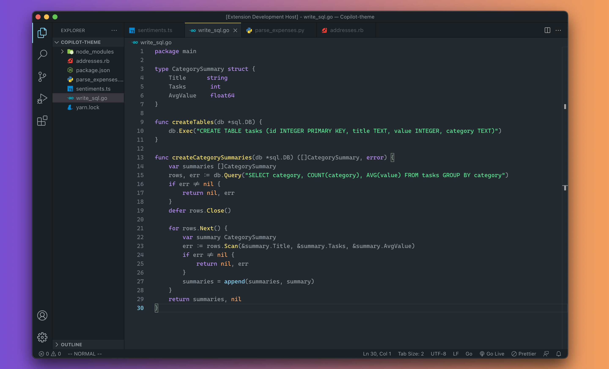
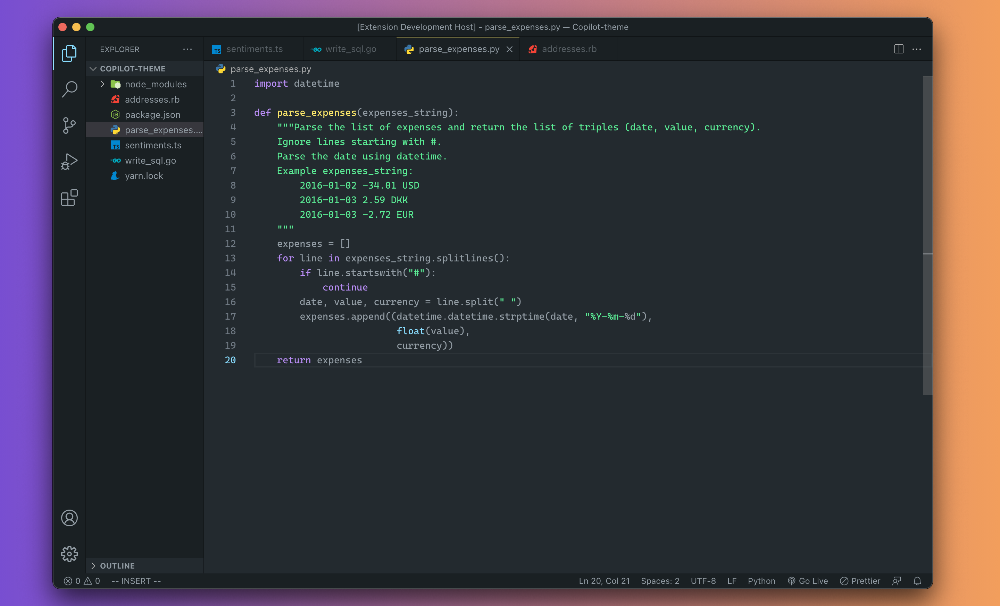
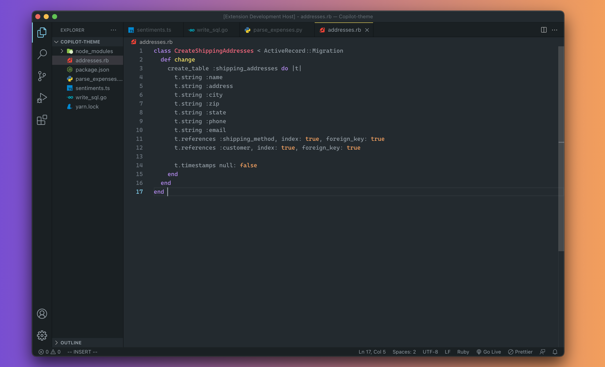

# Melodark Theme

A VSCode implementation of the theme displayed on [Github Copilot website](https://copilot.github.com/) combined with [Community Material Theme Ocean High-Contrast](https://github.com/material-theme/).

Font used: [Cascadia Code](https://github.com/microsoft/cascadia-code)

### Images:

Typescript

Go

Python

Ruby

 

_Code snippets in the examples are directly taken from [Github Copilot website](https://copilot.github.com/) and [Community Material Theme Ocean High-Contrast](https://github.com/material-theme/).
_.
